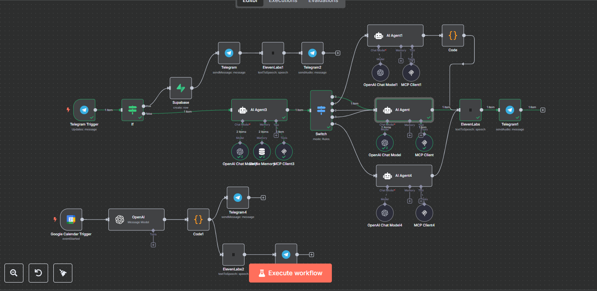
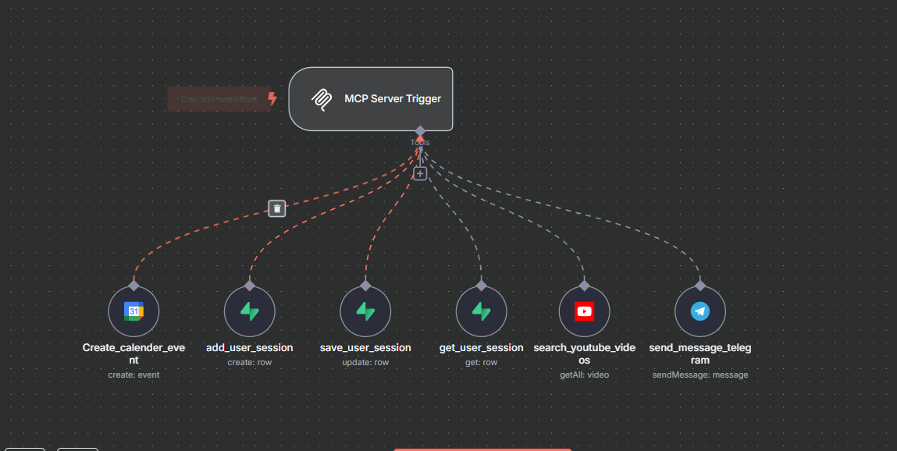

# 🎓 Conversational Learning Companion

---

## 📌 Overview

The **Conversational Learning Companion** is an advanced **multi-agent orchestration workflow** built in **n8n**.  
It acts as an AI-powered study assistant for students — helping them ask questions, take quizzes, create personalized study plans, and receive reminders — all through **Telegram**, **Google Calendar**, **Supabase**, and the **MCP Server**.

**✅ Note:** This is *not* a RAG (Retrieval-Augmented Generation) pipeline. It uses smart agents, session management, and dynamic generation — but does not perform vector-based document retrieval.

---

## ⚙️ Key Features

### 🤖 1. Conversational AI Agents
- Understands different **message types**:
  - **General Questions**
  - **Quiz Requests**
  - **Quiz Answers**
  - **Study Plan Requests**
  - **Video Requests**

- Classifies messages automatically and routes them to the right AI agent logic.

---

### 🧩 2. Multi-Tool Orchestration
- **OpenAI**: Generates quiz questions, answers, explanations, and study plans.
- **Supabase**: Stores user sessions, tracks quiz progress, last topics, and study plans.
- **MCP Server**: Manages tool calls for YouTube search, session management, and other custom operations.
- **Google Calendar**: Creates study plan events with reminders.
- **Telegram Bot**: Handles all incoming messages and delivers AI responses.
- **ElevenLabs**: Converts text answers into audio replies for more engaging interaction.

---

### 🔄 3. Personalized Study Plans
- Parses user messages like **"Create a 5-day Python study plan"**.
- Automatically builds day-wise topics.
- Saves the plan to Supabase.
- Schedules daily study sessions in **Google Calendar**.
- Confirms everything via Telegram with a neat summary.
- Sends audio reminders or motivational nudges.

---

### 📚 4. Quizzes and Interactive Learning
- Users can request quizzes.
- The bot tracks quiz progress.
- Answers are checked in real time.
- Instant feedback and scoring updates.
- Keeps quiz state synced with Supabase.

---

### 🗂️ 5. Smart Video Suggestions
- If a student asks for a YouTube video:
  - The agent extracts the topic.
  - Runs a YouTube search.
  - Shares 3 relevant video links.
  - Updates the user’s session with the new topic.

---

## 🧑‍💻 Technologies Used

- [n8n](https://n8n.io) — Low-code workflow automation
- [OpenAI GPT](https://openai.com)
- [Supabase](https://supabase.com) — Database for sessions
- [Telegram Bot API](https://core.telegram.org/bots/api)
- [Google Calendar API](https://developers.google.com/calendar)
- [ElevenLabs](https://elevenlabs.io) — Text-to-Speech
- MCP Server — For custom server-side orchestration

---
